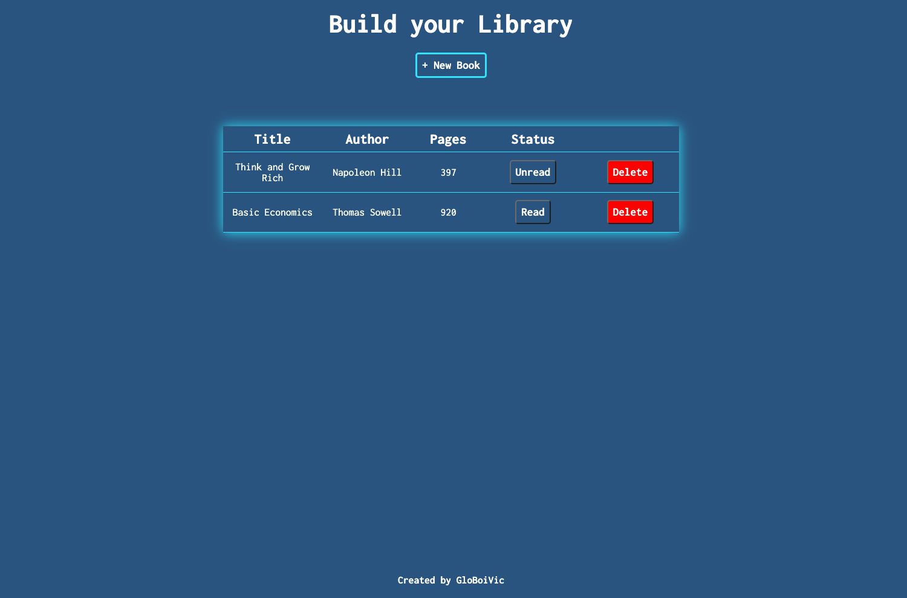

<h1 align="center">Library App</h1>

   A Project from <a href="https://www.theodinproject.com/" target="_blank">The Odin Project</a>.

  <h3>
    <a href="https://globoivic.github.io/TOP-Library-App/">
      Demo
    </a>
     | 
    <a href="https://github.com/GloBoiVic/TOP-Library-App">
      Github Repo
    </a>
     | 
    <a href="https://www.theodinproject.com/lessons/node-path-javascript-library">
      Project Description
    </a>
  </h3>

## :file_folder: Table of Contents

- [General Info](#general-information)
- [Technologies Used](#technologies-used)
- [Features](#features)
- [Screenshots](#screenshots)
- [Room for Improvement](#room-for-improvement)
- [Contact](#contact)

## :page_facing_up: General Information

Project Library in the Odin JavaScript course

## :computer: Technologies Used

- HTML
- CSS
- JavaScript

## :fire: Features

Upon clicking the add book button, a modal pops up with a form input asking for the book entry info. Upon successful add, book information gets displayed to the page in table formation. User can delete a book from the library and toggle whether or not they read the book

## :camera: Screenshots

## :heavy_exclamation_mark: Room for Improvement

To improve this project, I would like to:

- Add local storage to store books in the user's browser

## :bust_in_silhouette: Contact

- GitHub [@GloBoiVic](https://github.com/vicdatrader) - please reach out to me! I want to connect with other coders!
